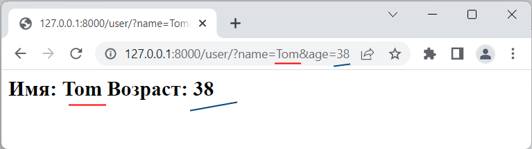
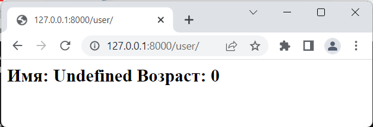
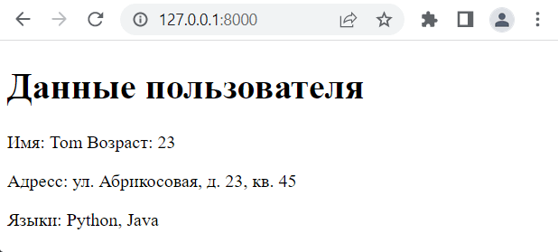
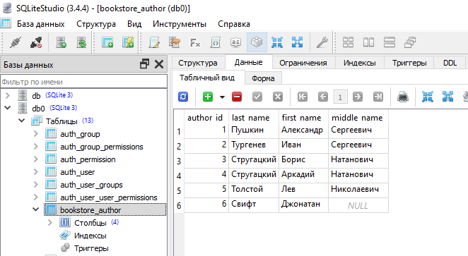

## Параметры запроса 

От параметров, которые передаются через адрес URL, следует отличать параметры, которые передаются через строку запроса. Например, в запросе

`http://127.0.0.1:8000/index/3/Tom/`


два последних сегмента - `3/Tom`/ представляют параметры URL или параметры маршрута. А в запросе

`http://127.0.0.1:8000/index?id=3&name=Tom`

те же самые значения 3 и Tom представляют параметры строки запроса.

Параметры строки запроса указывается после вопросительного знака ?. 

Каждый параметр предсталяет пару ключ-значение, напимер, в `id=3` : id - название или ключ параметра, а 3 - его значение. 

Параметры в строке запроса отделяются друг от друга знаком амперсанда.

Для получения параметров из строки запроса применяется метод `request.GET.get()`, в которую передается название параметра.

Например, определим в файле views.py следующие функции:

```python
from django.http import HttpResponse
   
def index(request):
    return HttpResponse("<h2>Главная</h2>")
  
def user(request):
    age = request.GET.get("age")
    name = request.GET.get("name")
    return HttpResponse(f"<h2>Имя: {name}  Возраст: {age}</h2>")

```

Функция user принимает извлекает из строки запроса два параметра: `name` и `age`.

В файле `urls.py` определим следующие маршруты:

```python
from django.urls import path
from hello import views
  
urlpatterns = [
    path("", views.index),
    path("user/", views.user)
]

```


При обращении к приложению по адресу `http://127.0.0.1:8000/user/?name=Tom&age=22`, параметр name будет иметь значение `"Tom"`, а параметр `age - 22`.




Второй параметр функции request.GET.get() представляет значение по умолчанию для параметра, для которого не задано значение.

Соответственно при обращении по адресу http://127.0.0.1:8000/user/ параметры name и age получат значения по умолчанию:





## Модуль 18. Основы использования шаблонов


Одним из преимуществ шаблонов является то, что мы можем передать в них динамически из представлений различные данные. 

Для вывода данных в шаблоне могут использоваться различные способы. Для вывода самых простых данных применяется двойная пара фигурных скобок:

```python

def index(request):
    return render(request, "index.html")

def index(request):
    data = {"header": "Hello", "message": " Django"}
    return render(request, "index.html", context=data)

```

Здесь используется две переменных: message и header. Они будут передаваться из представления.

Чтобы из функции-представления передать данные в шаблон применяется третий параметр функции render, который еще называется context и который представляет словарь. Например, изменим файл views.py следующим образом:


```html
<h2>{{ header }}</h2>
<p> {{ message }}</p>
```

В шаблоне используются две переменных, соответственно словарь, который передается в функцию render через параметр context, теперь содержит два значения с ключами header и message.


## Передача сложных данных

```python
#  более сложные данные

def index(request):
    header = "Писатели"              # обычная переменная
    books = ["Мцыри", "Евгений онегин", "C#"]            # список
    authors ={"name" : "Пушкин", "age" : 37}          # словарь
    address = ("Петербург", "Фонтанка", 45)           # кортеж
  
    data = {"header": header, "langs": langs, "user": user, "address": address}
    return render(request, "index.html", context=data)

```

В качестве третьего параметра в функцию render нам надо передать словарь, поэтому все данные оборачиваются в словарь и в таком виде передаются в шаблон.

В этом случае шаблон мог бы выглядеть, например, следующим образом:

```html
<h1>{{ header }}</h1>
<p>Имя: {{ user.name}} Возраст: {{user.age}}</p>
<p>Адресс: ул. {{address.0}}, д. {{address.1}}, кв. {{address.2}}</p>
<p>Языки: {{langs.0}}, {{langs.1}}</p>
```

Поскольку объекты `langs` и `address` представляют соответственно массив и кортеж, то мы можем обратиться к их элементам через индексы, как мы бы работали бы с ними в коде на Python, например, первый элемент кортежа address: address.0.

Подобным образом, поскольку объект user представляет словарь, то мы можем обратиться к его элементам по ключам name и age: `{{ user.name}} {{user.age}}`.



## TemplateResponse

Если для генерации шаблона применяется класс `TemplateResponse`, то в его конструктор также через третий параметр можно передать данные для шаблона:

```python
data = {"header": header, "langs": langs, "user": user, "address": address}
return TemplateResponse(request,  "index.html", data)

```

## Передача объектов классов

```python

class Person:
  
    def __init__(self, name):
        self.name = name    # имя человека

def index(request):
    return render(request, "index.html", context = {"person": Person("Tom")})
 

```


```python
class Author(models.Model):
    author_id = models.AutoField(primary_key=True)
    last_name = models.TextField(max_length=100)
    first_name = models.TextField(max_length=100)
    middle_name = models.TextField(max_length=100, null=True, blank=True)


    def __str__(self):
        return self.last_name

```

В SQLliteStudio заполним таблица авторов





```sql
INSERT INTO bookstore_author(last_name, first_name, middle_name)
    VALUES
    ('Пушкин', 'Александр', 'Сергеевич'),
    ('Тургенев', 'Иван', 'Сергеевич'),
    ('Стругацкий', 'Борис', 'Натанович'),
    ('Стругацкий', 'Аркадий', 'Натанович'),
    ('Толстой', 'Лев', 'Николаевич'),
    ('Свифт', 'Джонатан', NULL);

```


```sh
python manage.py shell
```


